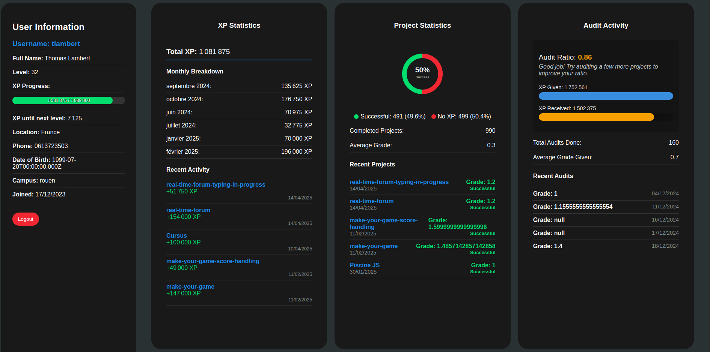

# GraphQL Dashboard

A visualization dashboard for Zone01 student data using the GraphQL API. This web application provides an interactive interface to view your progress, XP, projects, and audit statistics.



## Features

- **Authentication System**: Secure login using Zone01's authentication API
- **User Profile**: Display personal information and profile details
- **XP Statistics**: View total XP, monthly breakdown, and recent XP activities
- **Project Stats**: Visual representation of successful vs. unsuccessful projects with a dynamic SVG chart
- **Audit Activity**: Track your audit ratio, XP received and given through audits
- **Progress Graph**: Interactive line graph showing XP progression over time

## Technologies Used

- Vanilla JavaScript
- HTML5 & CSS3
- SVG for data visualization
- GraphQL for data fetching
- JWT authentication

## Installation

1. Clone this repository:
```bash
git clone https://github.com/your-username/GraphQL.git
cd GraphQL
```


2. Open the project in your preferred code editor
3. Use a local development server like Live Server to run the application

## Usage

1. Open the application in your web browser
2. Log in with your Zone01 credentials
3. Navigate through the dashboard to view your statistics:
   - Left sidebar: Personal information and level progress
   - Top boxes: XP, Projects, and Audit statistics
   - Bottom graph: XP progression over time

## Security Notes

- Your credentials are never stored locally - only the JWT authentication token
- The token is automatically removed when logging out
- For production deployment, consider using environment variables instead of hardcoded values

## Data Visualization

The dashboard includes several data visualizations:

1. **XP Progress Bar**: Shows progress to next level
2. **Project Success Circle**: Visual representation of successful vs. unsuccessful projects
3. **Audit Ratio Bars**: Compare XP given vs. received in audits
4. **XP Timeline Graph**: Interactive chart showing XP growth over time

## License

This project is licensed under the MIT License - see the LICENSE file for details.

## Acknowledgements

- Zone01 Normandie for providing the GraphQL API
